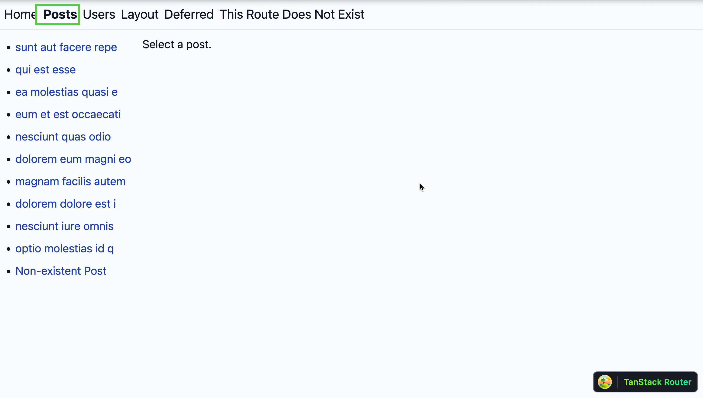

## Why Use TanStack Start Framework?

TanStack Start introduces several enhancements that aim to improve developer workflow and application performance. Here's a breakdown:

TanStack Start offers a comprehensive framework for building modern web applications with advanced features and improved developer experience.

### For Developers:

- **Simplified Setup**: TanStack Start provides a unified package that integrates routing, data fetching, and state management, streamlining the development process.
- **Advanced Data Handling**: The framework offers powerful primitives for caching, invalidating, and composing server-side state, including support for React Server Components.
- **Efficient Streaming**: TanStack Start has built-in support for streaming data and HTML to the client, enabling incremental content delivery without added complexity.
- **Full-Stack Development**: The framework supports both server-first and client-first architectures, allowing developers to build applications that leverage the best of both worlds.
- **Improved Type Safety**: TanStack Start provides contextual type safety throughout the application, from route definitions to navigation and state management, enhancing code reliability.
- **Flexible Routing**: The framework supports various routing strategies, including configuration-based, file-based, and component-based routing, catering to different project needs.

### Performance and Scalability:

- **Optimized for Speed**: TanStack Start is designed for high performance, with efficient route matching and rendering capabilities.
- **Seamless Data Integration**: Deep integration between routing and data fetching (via TanStack Query) enables efficient prefetching, caching, and streaming of data.
- **Future-Ready Architecture**: The framework is built to handle upcoming web technologies, including React Server Components and advanced streaming capabilities.

TanStack Start combines the power of TanStack Router with additional full-stack features, making it a compelling choice for developers looking to build scalable, performant, and type-safe web applications.

[TanStack Start Documentation](https://tanstack.com/start/latest/docs/framework/react/quick-start)

## Strapi 5 Highlights

The out-of-the-box Strapi features allow you to get up and running in no time:

1. **Single types**: Create one-off pages that have a unique content structure.
2. **Draft and Publish**: Reduce the risk of publishing errors and streamline collaboration.
3. **100% TypeScript Support**: Enjoy type safety & easy maintainability
4. **Customizable API**: With Strapi, you can just hop in your code editor and edit the code to fit your API to your needs.
5. **Integrations**: Strapi supports integrations with Cloudinary, SendGrid, Algolia, and others.
6. **Editor interface**: The editor allows you to pull in dynamic blocks of content.
7. **Authentication**: Secure and authorize access to your API with JWT or providers.
8. **RBAC**: Help maximize operational efficiency, reduce dev team support work, and safeguard against unauthorized access or configuration modifications.
9. **i18n**: Manage content in multiple languages. Easily query the different locales through the API.
10. **Plugins**: Customize and extend Strapi using plugins.

Learn more about [Strapi 5 feature](https://strapi.io/five).

<cta title="See Strapi in action with an interactive demo" text="Explore Strapi in an instant, hands-on demo set up just for you." buttontext="Access Live Demo!" buttonlink="https://strapi.io/demo"></cta>

## Setup Strapi 5 Headless CMS

We are going to start by setting up our [Strapi 5](https://strapi.io/five) project with the following command:

> 🖐️ Note: make sure that you have created a new directory for your project.

You can find the full documentation for Strapi 5 [here](https://docs.strapi.io/dev-docs/intro).

### Install Strapi

```bash
npx create-strapi-app@latest server
```

You will be asked to choose if you would like to use Strapi Cloud we will choose to skip for now.

```bash
 Strapi   v5.6.0 🚀 Let's create your new project


We can't find any auth credentials in your Strapi config.

Create a free account on Strapi Cloud and benefit from:

- ✦ Blazing-fast ✦ deployment for your projects
- ✦ Exclusive ✦ access to resources to make your project successful
- An ✦ Awesome ✦ community and full enjoyment of Strapi's ecosystem

Start your 14-day free trial now!


? Please log in or sign up.
  Login/Sign up
❯ Skip
```

After that, you will be asked how you would like to set up your project. We will choose the following options:

```bash
? Do you want to use the default database (sqlite) ? Yes
? Start with an example structure & data? Yes <-- make sure you say yes
? Start with Typescript? Yes
? Install dependencies with npm? Yes
? Initialize a git repository? Yes
```

Once everything is set up and all the dependencies are installed, you can start your Strapi server with the following command:

```bash
cd server
npm run develop
```

You will be greeted with the **Admin Create Account** screen.


Go ahead and create your first Strapi user. All of this is local so you can use whatever you want.

Once you have created your user, you will be redirected to the **Strapi Dashboard** screen.


### Publish Article Entries

Since we created our app with the example data, you should be able to navigate to your **Article** collection and see the data that was created for us.


Now, let's make sure that all of the data is **published**. If not, you can select all items via the checkbox and then click the **Publish** button.


### Enable API Access

Once all your articles are published, we will expose our Strapi API for the **Articles Collection**. This can be done in **_Settings -> Users & Permissions plugin -> Roles -> Public -> Article_**.

You should have `find` and `findOne` selected. If not, go ahead and select them.


### Test API

Now, if we make a `GET` request to `http://localhost:1337/api/articles`, we should see the following data for our articles.


> 🖐️ Note: The article covers (images) are not returned. This is because the REST API by default does not populate any relations, media fields, components, or dynamic zones.. Learn more about [REST API: Population & Field Selection](https://docs.strapi.io/dev-docs/api/rest/populate-select).

So, let's get the article covers by using the `populate=*` parameter: `http://localhost:1337/api/articles?populate=*`


Nice, now that we have our Strapi 5 server setup, we can start to setup TanStack Start.

## Getting Started with TanStack Start

I will walk you through the steps to setup a TanStack Start project. But here is the link to the [TanStack Start Docs](https://tanstack.com/start/latest/docs/framework/react/quick-start) that I used for reference.

### TanStack Start Installation and Initial Setup

Make sure that you are in the `root` directory of your project and run the following command to install an example TanStack Start project based on the docs.

This is a quick and easy way to get started with TanStack Start and learn about the basic functionality of the framework.

```bash
  npx degit https://github.com/tanstack/router/examples/react/start-basic client
  cd client
  npm install
  npm run dev
```

Once everything is installed, and your project is running we should see the following screen. I navigated to the **Posts** page, where you can see the basic view of all the posts fetched from `https://jsonplaceholder.typicode.com/posts`.




Nice, now that we have our TanStack Start client setup, we can start to integrate it with our Strapi 5 server.

You can find the data fetching logic in the `app/utils/posts.ts` file.

The code will look like the following:

```ts
import { notFound } from '@tanstack/react-router'
import { createServerFn } from '@tanstack/start'
import axios from 'redaxios'

export type PostType = {
  id: string
  title: string
  body: string
}

export const fetchPost = createServerFn({ method: 'GET' })
  .validator((d: string) => d)
  .handler(async ({ data }) => {
    console.info(`Fetching post with id ${data}...`)
    const post = await axios
      .get<PostType>(`https://jsonplaceholder.typicode.com/posts/${data}`)
      .then((r) => r.data)
      .catch((err) => {
        console.error(err)
        if (err.status === 404) {
          throw notFound()
        }
        throw err
      })

    return post
  })

export const fetchPosts = createServerFn({ method: 'GET' }).handler(
  async () => {
    console.info('Fetching posts...')
    return axios
      .get<Array<PostType>>('https://jsonplaceholder.typicode.com/posts')
      .then((r) => r.data.slice(0, 10))
  },
)

```

Notice we are fetching the post from `jsonplaceholder` api. Let's update the code to fetch the posts from our Strapi 5 server.

The updated file should look like the following:

```ts
import { notFound } from "@tanstack/react-router";
import { createServerFn } from "@tanstack/start";
import qs from "qs";
import axios from "redaxios";

import { getStrapiURL } from "./strapi";

const BASE_API_URL = getStrapiURL();

interface StrapiArrayResponse<T> {
  data: T[];
  meta: {
    pagination: {
      page: number;
      pageSize: number;
      pageCount: number;
      total: number;
    };
  };
}

interface StrapiResponse<T> {
  data: T;
}

interface CoverImage {
  url: string;
  alternativeText: string;
}

export type PostType = {
  id: number;
  documentId: string;
  title: string;
  description: string;
  slug: string;
  createdAt: string;
  updatedAt: string;
  publishedAt: string;
  cover: CoverImage;
  blocks: any[];
};

export const fetchPost = createServerFn({ method: "GET" })
  .validator((d: string) => d)
  .handler(async ({ data }) => {
    console.info(`Fetching post with id ${data}...`);

    const path = "/api/articles/" + data;
    const url = new URL(path, BASE_API_URL);

    url.search = qs.stringify({
      populate: {
        cover: {
          fields: ["url", "alternativeText"],
        },
        blocks: {
          populate: "*",
        },
      },
    });

    const post = await axios
      .get<StrapiResponse<PostType>>(url.href)
      .then((r) => {
        // console.dir(r.data, { depth: null });
        return r.data.data;
      })
      .catch((err) => {
        console.error(err);
        if (err.status === 404) {
          throw notFound();
        }
        throw err;
      });

    return post;
  });

export const fetchPosts = createServerFn({ method: "GET" }).handler(
  async () => {
    console.info("Fetching posts...");

    const path = "/api/articles";
    const url = new URL(path, BASE_API_URL);

    url.search = qs.stringify({
      populate: {
        cover: {
          fields: ["url", "alternativeText"],
        },
      },
    });

    return axios.get<StrapiArrayResponse<PostType>>(url.href).then((r) => {
      console.dir(r.data, { depth: null });
      return r.data.data; // Extract the data array from the Strapi response
    });
  }
);

```

Notice that we are importing the `qs` package to help with the query string, and we are using the `getStrapiURL` function to get the base URL of our Strapi 5 server.

Let's first add the `qs` package to our project and it's types with the following command:

```bash
  npm i qs
  npm i @types/qs
```

Now in the `utils` folder, create a new file called `strapi.ts` and update the file with the following code:

```ts
export function getStrapiURL() {
  return import.meta.env.VITE_STRAPI_BASE_URL ?? "http://localhost:1337";
}

export function getStrapiMedia(url: string | null) {
  if (url == null) return null;
  if (url.startsWith("data:")) return url;
  if (url.startsWith("http") || url.startsWith("//")) return url;
  return `${getStrapiURL()}${url}`;
}
```

We will use the `getStrapiURL` function to get the base URL of our Strapi 5 server and the `getStrapiMedia` function to get the media URL path of our files stored in Strapi.

Now before we can see our data, we need to update the following routes to take into account that we are fetching data from our Strapi 5 server.

In the `app/routes/posts.tsx` route, update the file to the following:

```tsx
import { Link, Outlet, createFileRoute } from '@tanstack/react-router'
import { fetchPosts } from '../utils/posts'

export const Route = createFileRoute('/posts')({
  loader: async () => fetchPosts(),
  component: PostsComponent,
})

function PostsComponent() {
  const posts = Route.useLoaderData()

  return (
    <div className="max-w-7xl mx-auto p-6 flex gap-8">
      <div className="w-1/3 bg-white rounded-lg shadow-md p-6">
        <h2 className="text-xl font-semibold mb-4 text-gray-800">Posts</h2>
        <ul className="space-y-2">
          {posts.map(
            (post) => {
              return (
                <li key={post.documentId}>
                  <Link
                    to="/posts/$postId"
                    params={{
                      postId: post.documentId,
                    }}
                    className="block px-4 py-2 rounded-md transition-colors hover:bg-blue-50 text-blue-600 hover:text-blue-800"
                    activeProps={{ 
                      className: 'bg-blue-100 text-blue-900 font-medium'
                    }}
                  >
                    <div>{post.title.substring(0, 20)}</div>
                  </Link>
                </li>
              )
            },
          )}
        </ul>
      </div>
      <div className="w-2/3">
        <Outlet />
      </div>
    </div>
  )
}

```

Now let's navigate to the `posts.$postId.tsx` route and update the file to the following:

```tsx
import { ErrorComponent, Link, createFileRoute } from "@tanstack/react-router";
import { fetchPost } from "../utils/posts";
import type { ErrorComponentProps } from "@tanstack/react-router";
import { NotFound } from "~/components/NotFound";
import { getStrapiMedia } from "~/utils/strapi";

export const Route = createFileRoute("/posts/$postId")({
  loader: ({ params: { postId } }) => fetchPost({ data: postId }),
  errorComponent: PostErrorComponent,
  component: PostComponent,
  notFoundComponent: () => {
    return <NotFound>Post not found</NotFound>;
  },
});

export function PostErrorComponent({ error }: ErrorComponentProps) {
  return <ErrorComponent error={error} />;
}

function PostComponent() {
  const post = Route.useLoaderData();
  const coverUrl = getStrapiMedia(post.cover.url);
  const formattedDate = new Date(post.publishedAt).toLocaleDateString("en-US", {
    year: "numeric",
    month: "long",
    day: "numeric",
  });

  return (
    <article className="max-w-2xl mx-auto p-6 space-y-6">
      {/* Hero Image */}
      <div className="relative aspect-video w-full overflow-hidden rounded-lg shadow-lg">
        
      </div>

      {/* Content */}
      <div className="space-y-4">
        <h1 className="text-3xl font-bold text-gray-900">{post.title}</h1>

        <div className="flex items-center text-sm text-gray-500">
          <time dateTime={post.publishedAt}>{formattedDate}</time>
        </div>

        <p className="text-lg text-gray-700">{post.description}</p>

        <Link
          to="/posts/$postId/deep"
          params={{
            postId: post.documentId,
          }}
          className="inline-block px-4 py-2 bg-blue-600 text-white rounded-md hover:bg-blue-700 transition-colors"
        >
          Read Full Article
        </Link>
      </div>
    </article>
  );
}
```


And finally, let's navigate to the `app/routes/posts.$postId.deep.tsx` file and update the file to the following:

```tsx
import { Link, createFileRoute } from "@tanstack/react-router";
import { fetchPost } from "../utils/posts";
import { PostErrorComponent } from "./posts.$postId";
import { getStrapiMedia } from "~/utils/strapi";
import { MarkdownText } from "~/components/MarkdownText";

function BlockRenderer(blocks: any) {
  return blocks.map((block: any, index: number) => {
    return <MarkdownText key={index} content={block.body} />;
  });
}

export const Route = createFileRoute("/posts_/$postId/deep")({
  loader: async ({ params: { postId } }) =>
    fetchPost({
      data: postId,
    }),
  errorComponent: PostErrorComponent,
  component: PostDeepComponent,
});

function PostDeepComponent() {
  const post = Route.useLoaderData();
  const coverUrl = getStrapiMedia(post.cover.url);

  console.log(post);

  return (
    <div className="max-w-3xl mx-auto p-6 space-y-6">
      <Link
        to="/posts"
        className="inline-flex items-center text-blue-600 hover:text-blue-800 transition-colors"
      >
        <span className="mr-2">←</span>Back to Posts
      </Link>

      {post.cover && (
        <div className="aspect-video relative overflow-hidden rounded-lg shadow-lg">
          
        </div>
      )}

      <article className="space-y-4">
        <h1 className="text-3xl font-bold text-gray-900">{post.title}</h1>
        <div className="flex items-center text-sm text-gray-500 space-x-4">
          <time dateTime={post.publishedAt}>
            {new Date(post.publishedAt).toLocaleDateString("en-US", {
              year: "numeric",
              month: "long",
              day: "numeric",
            })}
          </time>
          {post.updatedAt !== post.publishedAt && (
            <span>
              (Updated: {new Date(post.updatedAt).toLocaleDateString()})
            </span>
          )}
        </div>
        <p className="text-gray-700 leading-relaxed">{post.description}</p>
        {BlockRenderer(post.blocks)}
      </article>
    </div>
  );
}

```

Notice that we are using our `MarkdownText` component to render the markdown content of our post.

Let's create it in the `components` folder by adding a file called `MarkdownText.tsx` and update the file to the following:

```tsx
import Markdown from "react-markdown";
import remarkGfm from "remark-gfm";

export  function MarkdownText({ content }: { content: string }) {
  return (
    <section className="rich-text py-6 dark:bg-black dark:text-gray-50 ">
      <Markdown remarkPlugins={[remarkGfm]}>{content}</Markdown>
    </section>
  );
}
```

Now let's run the following to install the `react-markdown` and `remark-gfm` packages:

```bash
  npm i react-markdown remark-gfm
```

Now restart your TanStack Start app and navigate to **Posts** select an article, you should see the following:


And if you click on **Read Full Article**, you should see the following:


Awesome, great job!

## Github Project Repo

You can find the complete code for this project in the following [Github repo](https://github.com/PaulBratslavsky/react-router-7-strapi-5-example).

## Strapi Open Office Hours

If you have any questions about Strapi 5 or just would like to stop by and say hi, you can join us at **Strapi's Discord Open Office Hours** Monday through Friday at 12:30 pm - 1:30 pm CST: [Strapi Discord Open Office Hours](https://discord.com/invite/strapi)

For more details, visit the [Strapi documentation](https://strapi.io/documentation) and [React Router 7 documentation](https://reactrouter.com/home).
